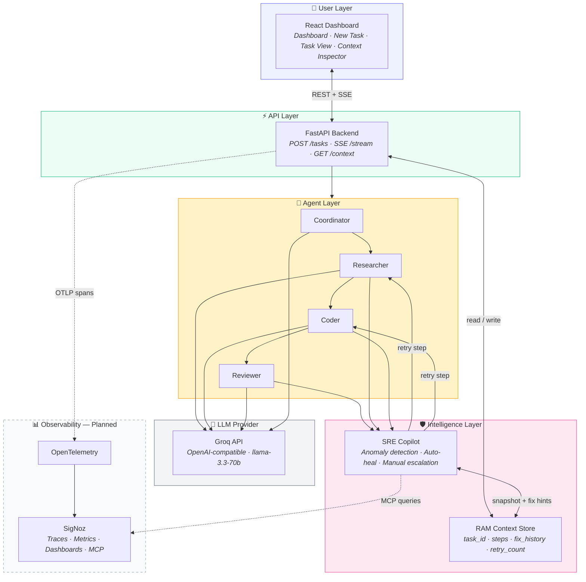
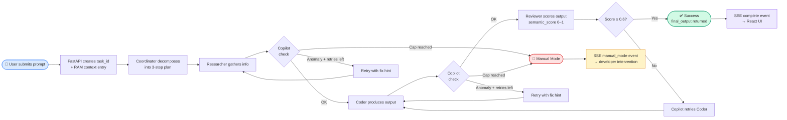
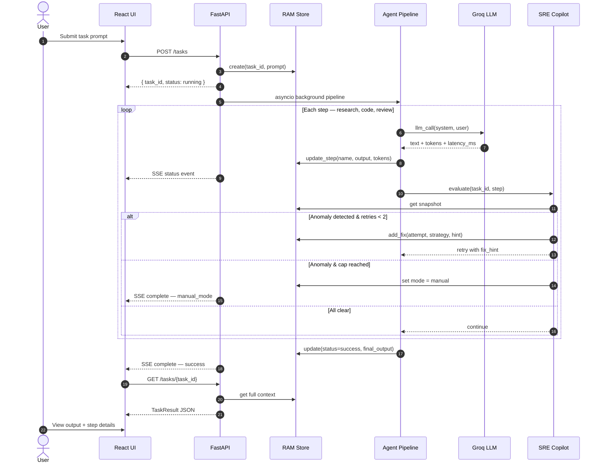
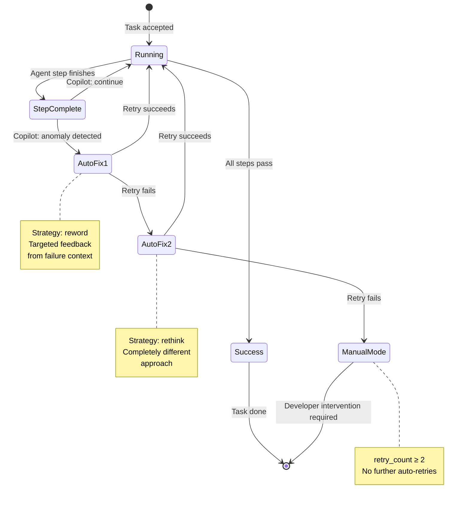
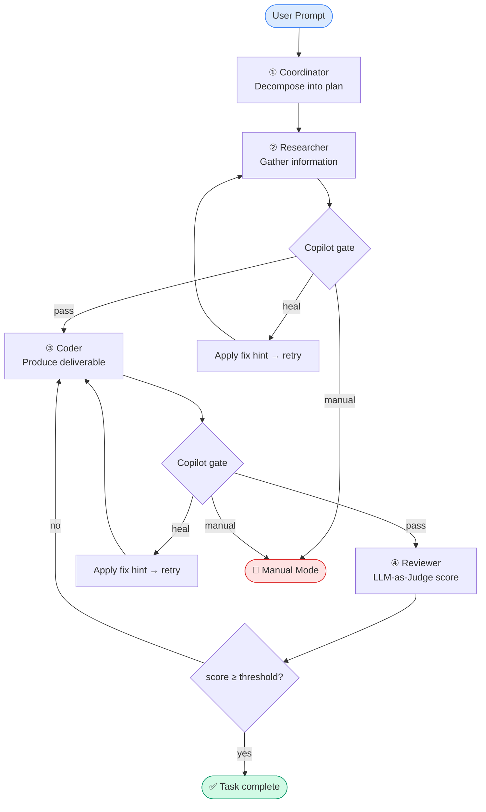

# SigNoz ForgeGuard — n8nForge Observer

**Agents of SigNoz 2026 — Track 1: AI & Agent Observability**

A hybrid multi-agent system with full pipeline visibility and self-healing. Submit a task, watch four specialized agents execute it in sequence, and let the SRE Copilot detect failures and attempt automatic recovery before escalating to manual mode.

Built for the hackathon goal: make agent workflows **observable**, **recoverable**, and **explainable** — not a black box of blind retries.

---

## Table of Contents

- [Overview](#overview)
- [System Diagrams](#system-diagrams)
- [Architecture](#architecture)
- [Repository Structure](#repository-structure)
- [Quick Start](#quick-start)
- [Configuration](#configuration)
- [API Reference](#api-reference)
- [Agent Pipeline](#agent-pipeline)
- [SRE Copilot & Self-Healing](#sre-copilot--self-healing)
- [Frontend](#frontend)
- [Roadmap](#roadmap)
- [Documentation](#documentation)

---

## Overview

n8nForge Observer runs a four-agent pipeline on every task:

| Agent | Role |
|-------|------|
| **Coordinator** | Decomposes the user prompt into research → code → review steps |
| **Researcher** | Gathers relevant information for the task |
| **Coder** | Produces the final deliverable from research findings |
| **Reviewer** | LLM-as-Judge quality scoring (0.0–1.0 semantic score) |

The **SRE Copilot** watches each step for anomalies (errors, low quality scores, empty output) and applies a **2-strike automatic healing policy** before switching to **Manual Mode** for developer intervention.

All in-flight task state lives in an **in-memory RAM context store** — fast, ephemeral, and keyed by `task_id`. No database.

---

## System Diagrams

### High-Level Architecture

Five layers from user intake to observability. Solid lines are implemented today; dashed lines are on the roadmap.



### End-to-End Data Flow

How a single task moves through the system from submission to completion.



### Request Lifecycle (Sequence)

Real-time interaction between the UI, backend, agents, and Copilot during a task run.



### Self-Healing State Machine

The Copilot's decision logic — the **2-strike rule** prevents infinite auto-retry loops.



---

## Architecture

### Layer Responsibilities

| Layer | Technology | Status |
|-------|-----------|--------|
| User interface | React + Vite + Tailwind | ✅ Implemented |
| API & orchestration | FastAPI + asyncio | ✅ Implemented |
| Agent execution | Async LLM agents (Groq) | ✅ Implemented |
| Quality evaluation | LLM-as-Judge (Reviewer) | ✅ Implemented |
| Self-healing | SRE Copilot + RAM store | ✅ Implemented |
| Instrumentation | OpenTelemetry → SigNoz | 🔜 Planned |
| External orchestration | n8n workflows | 🔜 Planned |

---

## Repository Structure

```
signoz/                          # Repository root
├── README.md                    # This file
├── n8nforge-observer/           # Main application
│   ├── backend/
│   │   ├── main.py              # FastAPI app, pipeline orchestration, SSE streaming
│   │   ├── config.py            # Environment settings (LLM, Copilot thresholds)
│   │   ├── llm.py               # Async OpenAI-compatible LLM client (Groq)
│   │   ├── context_store.py     # In-memory RAM context store
│   │   ├── copilot.py           # SRE Copilot — anomaly detection & healing
│   │   └── agents/
│   │       ├── coordinator.py   # Task decomposition
│   │       ├── researcher.py    # Information gathering
│   │       ├── coder.py         # Output production
│   │       └── reviewer.py      # LLM-as-Judge scoring
│   ├── frontend/                # React dashboard (v2.0)
│   │   ├── src/
│   │   │   ├── pages/           # Dashboard, NewTask, TaskView, Analytics, ContextInspector
│   │   │   └── lib/api.ts       # Backend API client + SSE subscription
│   │   └── vite.config.ts       # Dev proxy: /api → localhost:8000
│   └── requirements.txt
└── sig/                         # Design & planning docs
    ├── arch.md                  # Full architecture specification
    ├── spec.md                  # Functional requirements
    ├── context.md               # RAM context store design
    └── Plan.md                  # Build & demo plan
```

---

## Quick Start

### Prerequisites

- **Python 3.11+**
- **Node.js 18+**
- **Groq API key** ([console.groq.com](https://console.groq.com)) — or any OpenAI-compatible endpoint

### 1. Backend

```bash
cd n8nforge-observer

# Create virtual environment
python -m venv .venv
source .venv/bin/activate   # Windows: .venv\Scripts\activate

# Install dependencies
pip install -r requirements.txt

# Configure environment
cat > .env << 'EOF'
LLM_API_KEY=your_groq_api_key_here
LLM_BASE_URL=https://api.groq.com/openai/v1
LLM_MODEL=llama-3.3-70b-versatile
LLM_TEMPERATURE=0.3
MAX_AUTO_FIX_ATTEMPTS=2
SEMANTIC_SCORE_THRESHOLD=0.6
BACKEND_HOST=0.0.0.0
BACKEND_PORT=8000
EOF

# Run the API server
uvicorn backend.main:app --host 0.0.0.0 --port 8000 --reload
```

Verify: `curl http://localhost:8000/health` → `{"status":"ok","service":"n8nforge-observer"}`

### 2. Frontend

In a second terminal:

```bash
cd n8nforge-observer/frontend
npm install
npm run dev
```

Open **http://localhost:3000** — the Vite dev server proxies `/api` requests to the backend on port 8000.

### 3. Submit a Task

**Via UI:** Go to **New Task**, enter a prompt, and watch live progress on the task detail page.

**Via API:**

```bash
curl -X POST http://localhost:8000/tasks \
  -H "Content-Type: application/json" \
  -d '{"prompt": "Explain the tradeoffs between REST and GraphQL"}'
```

Poll for results:

```bash
curl http://localhost:8000/tasks/<task_id>
```

Stream live events (SSE):

```bash
curl -N http://localhost:8000/tasks/<task_id>/stream
```

---

## Configuration

All settings are loaded from `.env` in the `n8nforge-observer/` directory via `pydantic-settings`.

| Variable | Default | Description |
|----------|---------|-------------|
| `LLM_API_KEY` | *(required)* | API key for the LLM provider |
| `LLM_BASE_URL` | `https://api.groq.com/openai/v1` | OpenAI-compatible API base URL |
| `LLM_MODEL` | `llama-3.3-70b-versatile` | Model identifier |
| `LLM_TEMPERATURE` | `0.3` | Default sampling temperature |
| `MAX_AUTO_FIX_ATTEMPTS` | `2` | Auto-heal cap before Manual Mode |
| `SEMANTIC_SCORE_THRESHOLD` | `0.6` | Minimum Reviewer score (0.0–1.0) to pass |
| `BACKEND_HOST` | `0.0.0.0` | Server bind address |
| `BACKEND_PORT` | `8000` | Server port |

For production frontend builds, set `VITE_API_URL` to point at your deployed backend (defaults to `http://localhost:8000`).

---

## API Reference

| Method | Endpoint | Description |
|--------|----------|-------------|
| `GET` | `/health` | Health check |
| `POST` | `/tasks` | Submit a task (`{"prompt": "..."}`) — returns immediately with `task_id` |
| `GET` | `/tasks/{task_id}` | Get full task result (poll until `status != "running"`) |
| `GET` | `/tasks/{task_id}/stream` | SSE stream of live progress events |
| `POST` | `/tasks/{task_id}/cancel` | Cancel a running task |
| `GET` | `/context` | List active task IDs in RAM store |
| `GET` | `/context/{task_id}` | Snapshot of RAM context for a task |

### Task Status Values

| Status | Meaning |
|--------|---------|
| `running` | Pipeline in progress |
| `success` | Completed successfully |
| `manual_mode` | Auto-fix exhausted — developer intervention required |
| `error` | Unhandled exception |
| `cancelled` | Ended by user |

### SSE Events

| Event | Payload |
|-------|---------|
| `status` | Step progress (`step`, `status`, `message`, optional `attempt`) |
| `complete` | Final status (`success`, `manual_mode`, `cancelled`) |
| `error` | Error details |

---

## Agent Pipeline

Each submitted task runs through this sequence (see [End-to-End Data Flow](#end-to-end-data-flow) above):



Every agent call returns **token count** and **latency** metadata, tracked per step in the RAM context store.

---

## SRE Copilot & Self-Healing

The Copilot (`backend/copilot.py`) evaluates each agent step and decides: **continue**, **retry**, or **manual**.

### Anomaly Signals

- Agent exceptions / explicit errors
- Reviewer semantic score below `SEMANTIC_SCORE_THRESHOLD` (default 0.6)
- Nearly empty agent output (< 20 characters)

### Healing Strategies

| Attempt | Strategy | Behavior |
|---------|----------|----------|
| 1 | `reword` | Retry with targeted feedback from failure context |
| 2 | `rethink` | Retry with a completely different approach |
| 3+ | — | Switch to **Manual Mode** — no further auto-retries |

### State Machine

See the full [Self-Healing State Machine](#self-healing-state-machine) diagram in System Diagrams.

The **2-strike cap** is intentional: it prevents the healing mechanism itself from becoming an infinite retry loop — the exact failure mode this project is designed to solve.

---

## Frontend

The React UI (`n8nforge-observer/frontend/`) provides:

| Page | Route | Purpose |
|------|-------|---------|
| Dashboard | `/` | Backend health, active tasks, quick actions |
| New Task | `/new` | Submit prompts to the pipeline |
| Task View | `/task/:taskId` | Live SSE progress, step outputs, final result |
| Analytics | `/analytics` | Metrics the system tracks (tokens, latency, healing) |
| Context Inspector | `/context` | Live RAM context snapshots per active task |

**Stack:** React 18, TypeScript, Vite, Tailwind CSS, React Router, Lucide icons.

---

## Roadmap

Items from the design spec (`sig/`) not yet implemented in code:

- [ ] **OpenTelemetry instrumentation** — spans around every agent/tool call with token counts, latency, and semantic scores exported via OTLP
- [ ] **SigNoz integration** — trace waterfalls, dashboards (MTTR, fix-success rate, token cost)
- [ ] **SigNoz MCP Copilot** — query traces/metrics from SigNoz for richer anomaly detection (loop patterns, latency spikes)
- [ ] **n8n workflow orchestration** — webhook-driven intake and step re-trigger for manual fix mode
- [ ] **Docker Compose** — one-command local deployment with SigNoz
- [ ] **Persistent task history** — cross-session analytics in the frontend

See [`sig/Plan.md`](sig/Plan.md) for the full phased build plan and demo script.

---

## Documentation

Detailed design documents live in [`sig/`](sig/):

| Document | Contents |
|----------|----------|
| [`arch.md`](sig/arch.md) | Full architecture, component design, data flow |
| [`spec.md`](sig/spec.md) | Functional/non-functional requirements, acceptance criteria |
| [`context.md`](sig/context.md) | RAM context store data model and lifecycle |
| [`Plan.md`](sig/Plan.md) | Build phases, demo script, risk mitigations |

---

## License

Hackathon submission for **Agents of SigNoz 2026**.
