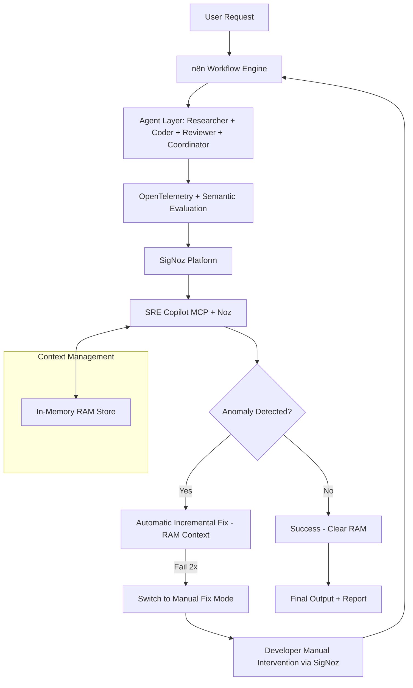

# arch.md — n8nForge Observer: Architecture

## 1. Architecture Overview

n8nForge Observer combines five layers: orchestration (n8n), agent execution (CrewAI + FastAPI), instrumentation (OpenTelemetry), observability (SigNoz), and intelligence (SRE Copilot + RAM context store). The system is designed so that every component's activity is correlated by a single `trace_id`, making the whole pipeline explainable rather than a black box.

## 2. High-Level Flowchart



## 3. Layer Responsibilities

| Layer | Technology | Responsibility |
|-------|-----------|-----------------|
| User Layer | n8n Webhook | Task input |
| Orchestration | n8n | Workflow control |
| Agent Layer | CrewAI + FastAPI | Task execution |
| Evaluation | LLM-as-Judge | Quality scoring |
| Instrumentation | OpenTelemetry | Data collection |
| Observability | SigNoz | Visualization & alerts |
| Intelligence | SRE Copilot + RAM Store | Detection & healing |

## 4. Component Design

### 4.1 n8n Workflow Engine
- Entry point via Webhook node.
- Generates `task_id` and root `trace_id` on intake.
- Owns the retry/re-trigger loop: calls the backend, waits for result or Copilot instruction, and re-invokes specific steps on either automatic or manual fix.
- Persists nothing itself — all state lives in the backend's RAM store during the task's lifetime.

### 4.2 Agent Layer (CrewAI + FastAPI)
- **Coordinator** — decomposes the task, assigns subtasks, tracks completion state.
- **Researcher** — gathers information via search/retrieval tools, writes findings to RAM context.
- **Coder** — produces code or content artifacts from Researcher's findings.
- **Reviewer** — evaluates output using an LLM-as-Judge rubric; emits a `semantic_score`.
- FastAPI exposes the endpoints n8n calls to trigger each agent step and to fetch/patch RAM context.

### 4.3 Instrumentation (`instrumentation.py`)
- Wraps every agent and tool call in an OpenTelemetry span.
- Captures: input/output token counts, latency, model identifier, tool-call parameters, and the Reviewer's `semantic_score`.
- Exports spans/metrics/logs to SigNoz via OTLP, all tagged with the shared `trace_id`.

### 4.4 Observability (SigNoz)
- Stores and visualizes traces, metrics, and logs.
- Hosts dashboards: trace waterfalls, token cost, MTTR, fix-success rate.
- Exposes an MCP server that the SRE Copilot queries for anomaly signals and trace/metric data.

### 4.5 SRE Copilot (`copilot.py`)
- MCP client that continuously queries SigNoz for:
  - Repeated identical tool calls (loop signal)
  - Reviewer score below threshold
  - Latency/token spikes vs. baseline
  - Explicit error spans
- Pulls the current RAM context snapshot for the affected `task_id` to reason with minimal, relevant state (not the full trace history).
- Drives the hybrid self-healing state machine (see Section 5).

### 4.6 Context Management (`context_store.py`)
- Simple in-memory dict/LRU cache keyed by `task_id`.
- Holds: original prompt, task plan, per-agent state, retry count.
- No database — ephemeral by design. Cleared automatically on task success or explicit cleanup call.

## 5. Self-Healing State Machine

```
Idle → Task Running → Anomaly Detected?
   No  → Success → Clear RAM → Done
   Yes → Auto-Fix Attempt 1 (RAM context)
           Success → Clear RAM → Done
           Fail → Auto-Fix Attempt 2 (updated RAM context)
                    Success → Clear RAM → Done
                    Fail → Manual Fix Mode
                             Developer inspects SigNoz + RAM snapshot
                             Developer edits & manually re-triggers step in n8n
                             Success → Clear RAM → Done
```

The 2-attempt cap is a deliberate design choice: it prevents the exact failure mode the project is meant to solve (infinite retry loops) from occurring inside the healing mechanism itself.

## 6. Data Flow Summary

1. Request enters via n8n Webhook → `task_id` + `trace_id` created.
2. n8n calls FastAPI backend → CrewAI agents execute in sequence/parallel per Coordinator's plan.
3. Every call is traced (OpenTelemetry) and scored (Reviewer) → data streams live to SigNoz.
4. SRE Copilot watches SigNoz + RAM store in parallel.
5. On anomaly, Copilot writes a targeted fix instruction back into RAM/agent input, and n8n re-runs the specific failing step.
6. On resolution, RAM is cleared and a final report is compiled and returned to the user.

## 7. Repository Layout

```
n8nforge-observer/
├── n8n/                  # workflow.json
├── backend/
│   ├── main.py
│   ├── agents/
│   ├── instrumentation.py
│   ├── copilot.py
│   └── context_store.py
├── dashboards/           # SigNoz JSON files
├── docker-compose.yml
├── .env.example
├── requirements.txt
├── README.md
└── architecture.md
```

## 8. Design Notes for Judges

- **RAM-only context (no DB):** keeps healing fast and stateless between tasks — a deliberate simplicity/speed tradeoff, with the known limitation of no cross-session memory.
- **2-strike auto-fix threshold:** prevents infinite auto-healing loops, mirroring the exact problem being solved.
- **Trace-context correlation is the differentiator:** tying RAM state directly to SigNoz traces via `trace_id` makes self-healing explainable rather than a black box.
